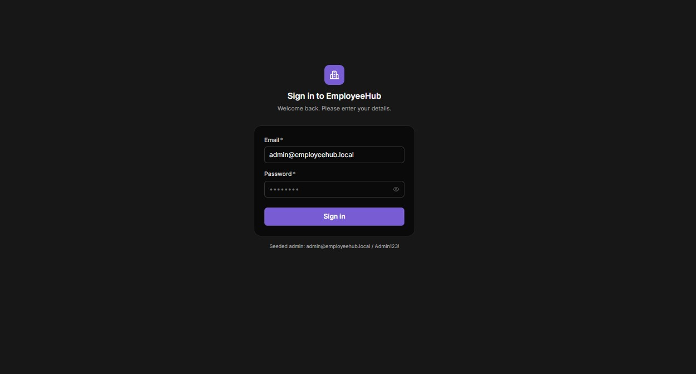
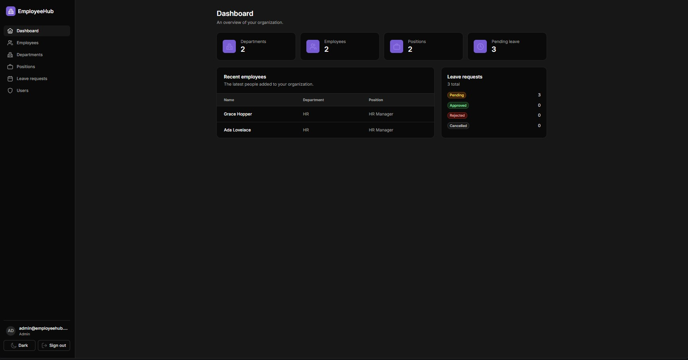
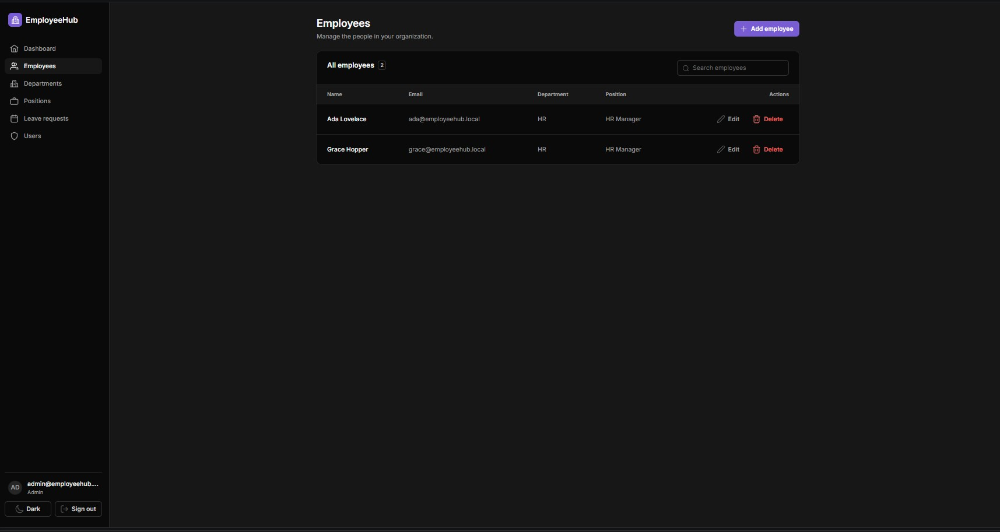
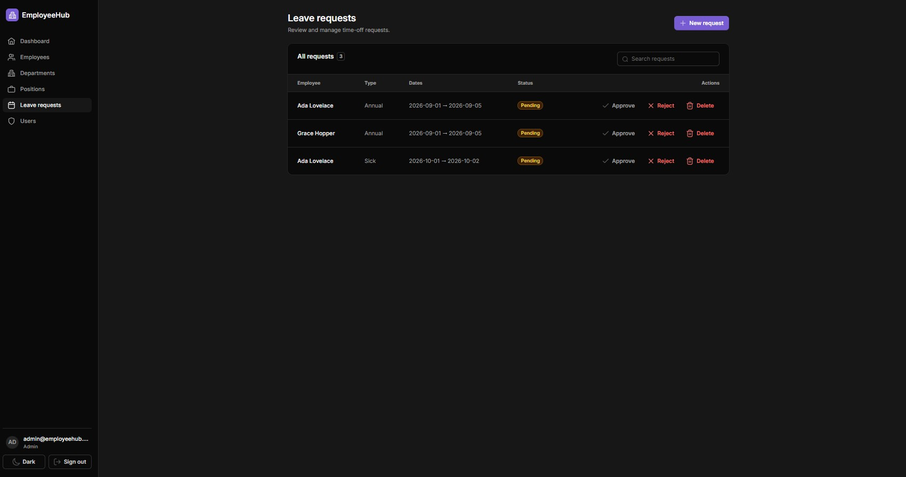

# EmployeeHub

A full-stack employee management application — an ASP.NET Core Web API backed by SQL Server and Entity Framework Core, with a React single-page frontend built on Untitled UI. Built as a portfolio project to demonstrate a realistic, secured, end-to-end CRUD application.

## Features

- **JWT authentication** — login, bearer-token protected API, auto-logout on expiry, seeded admin user
- **Account lifecycle** — self-service registration, email verification, and password reset (API only — see [Auth flows](#auth-flows))
- **Role-based authorization** — `Admin` / `Manager` / `Employee` roles enforced on the API and reflected in the UI (see [Roles and access](#roles-and-access))
- **Dashboard** — live counts (employees, departments, positions), pending-leave count, leave-status breakdown, and recent hires (manager+)
- **Departments** — full CRUD with validation and an in-use delete guard; writes are manager+
- **Positions** — full CRUD; writes are manager+
- **Employees** — full CRUD with department & position assignment (manager+)
- **Leave requests** — submit for yourself, or for anyone as a manager; approve/reject and delete (manager+), with status badges
- **Users** — admin-only account management with optional employee linking
- **UX polish** — toast notifications, table search, loading & empty states, delete confirmations, and a light/dark theme toggle

## Tech stack

| Layer     | Technology                                                                 |
| --------- | -------------------------------------------------------------------------- |
| Backend   | ASP.NET Core (.NET 10), Entity Framework Core, SQL Server                  |
| Auth      | JWT bearer tokens, role-based policies, ASP.NET Core `PasswordHasher`      |
| Frontend  | React 19 + TypeScript, Vite, React Router, Untitled UI (Tailwind CSS v4)   |

## Screenshots

| Login | Dashboard |
| ----- | --------- |
|  |  |

| Employees | Leave requests |
| --------- | -------------- |
|  |  |

## Repository layout

```text
EmployeeHub/
├── backend/EmployeeHub/
│   ├── EmployeeHub.Api/                # ASP.NET Core Web API
│   │   ├── Controllers/                # Auth, Dashboard, Departments, Employees, Positions, LeaveRequests, Users, Health
│   │   ├── Services/                   # Business logic (one service per aggregate)
│   │   ├── Models/                     # EF entities + enums
│   │   ├── DTOs/                       # Request/response contracts
│   │   ├── Data/                       # DbContext, migrations, seeder
│   │   ├── Extensions/                 # ClaimsPrincipal helpers for reading the caller's identity
│   │   └── Program.cs                  # DI, auth, authorization policies, CORS, pipeline
│   └── EmployeeHub.Api.Tests/          # Integration tests (xUnit + WebApplicationFactory)
└── frontend/                           # React SPA (Vite + Untitled UI)
    └── src/
        ├── pages/                      # login, dashboard, departments, positions, employees, leave-requests, users
        ├── components/                 # layout, guards, data-table, modal shell, toasts
        ├── providers/                  # auth, theme, toast, router
        └── lib/                        # API client + types
```

## Prerequisites

- [.NET 10 SDK](https://dotnet.microsoft.com/download)
- [Node.js](https://nodejs.org/) 20+ and npm
- SQL Server (the default connection string targets a local `SQLEXPRESS` instance)
- EF Core tools (for running migrations): `dotnet tool install --global dotnet-ef`

## Getting started

The app requires **both** the API and the frontend running at the same time. Use two terminals.

### 1. Backend API

```bash
cd backend/EmployeeHub/EmployeeHub.Api
dotnet run
```

On first run the API automatically applies EF migrations and seeds:

- an **admin user** — `admin@employeehub.local` / `Admin123!`
- a couple of starter departments and positions

The API listens on **<http://localhost:5023>** (see `Properties/launchSettings.json`).

### 2. Frontend

```bash
cd frontend
cp .env.example .env   # first time only
npm install            # first time only
npm run dev
```

Open the printed URL — **<http://localhost:5173>** — and sign in with the seeded admin credentials.

> The frontend reads the API base URL from `frontend/.env` (`VITE_API_URL`). If Vite starts on a
> different port, add that origin to `Cors:AllowedOrigins` in `appsettings.json` or the browser will
> block API calls.

## Roles and access

Being signed in is not the same as being trusted. Because anyone can register an account, the
employee directory and everyone's leave records are gated on role rather than on merely holding a
valid token:

| Role         | Can see                                                                      |
| ------------ | ---------------------------------------------------------------------------- |
| **Employee** | Headline dashboard counts, departments and positions, and *their own* leave  |
| **Manager**  | Everything above, plus the employee directory and all leave requests         |
| **Admin**    | Everything above, plus user account management                               |

A self-registered account starts as an unlinked `Employee`: until an admin links it to an employee
record, it has no leave of its own and cannot request any. The dashboard's recent-hire list and
per-department headcount are omitted from the response entirely for non-managers rather than hidden
in the UI.

## Auth flows

Registration, email verification, and password reset are implemented **on the API only** — the SPA
currently ships the login screen, so these are exercised via HTTP (see `EmployeeHub.Api.http`) rather
than through the UI. Wiring up the corresponding pages is on the [roadmap](#roadmap).

Registration deliberately returns **no token**: the account is created unverified, and
`POST /auth/login` refuses unverified accounts. Verification and reset links are dispatched through
`IEmailSender`, whose development implementation writes the message to the API console — so in local
development you copy the link out of the backend's log output. Reset tokens expire after one hour;
`POST /auth/forgot-password` always returns `200` whether or not the email matches an account, so it
cannot be used to discover which addresses are registered.

## API overview

All endpoints are under `/api`. Every route except the anonymous ones below requires an
`Authorization: Bearer <token>` header.

| Method             | Route                          | Access          | Description                                 |
| ------------------ | ------------------------------ | --------------- | ------------------------------------------- |
| `POST`             | `/auth/login`                  | Anonymous       | Authenticate, returns a JWT + user           |
| `POST`             | `/auth/register`               | Anonymous       | Create an unverified account, email a link   |
| `POST`             | `/auth/forgot-password`        | Anonymous       | Email a password reset link                  |
| `POST`             | `/auth/reset-password`         | Anonymous       | Consume a reset token and set a new password |
| `POST`             | `/auth/verify-email`           | Anonymous       | Consume an email verification token          |
| `GET`              | `/auth/me`                     | Authenticated   | Current user from the token                  |
| `GET`              | `/dashboard/stats`             | Authenticated   | Dashboard metrics, trimmed for non-managers  |
| `GET`              | `/departments`, `/positions`   | Authenticated   | List departments / positions                 |
| `POST/PUT/DELETE`  | `/departments`, `/positions`   | Manager / Admin | Create / update / delete                     |
| `GET/POST`         | `/employees`                   | Manager / Admin | List / create employees                      |
| `GET/PUT/DELETE`   | `/employees/{id}`              | Manager / Admin | Read / update / delete an employee           |
| `GET`              | `/leave-requests`              | Authenticated   | All requests for managers; own requests only otherwise |
| `POST`             | `/leave-requests`              | Authenticated   | Submit a request (only for yourself unless manager) |
| `PUT`              | `/leave-requests/{id}/status`  | Manager / Admin | Approve or reject a request                  |
| `DELETE`           | `/leave-requests/{id}`         | Manager / Admin | Delete a leave request                       |
| `GET/POST`         | `/users`                       | Admin           | List / create user accounts                  |
| `DELETE`           | `/users/{id}`                  | Admin           | Delete a user account                        |
| `GET`              | `/health`                      | Anonymous       | Health check                                 |

## Tests

The suite is integration-level: it boots the real API pipeline with
`WebApplicationFactory<Program>` against an in-memory SQLite database, so the actual
`[Authorize]` attributes and policies are exercised rather than mocked away. It focuses on the
access rules, since those are the claims worth proving — role gating per endpoint, the
email-verification login gate, per-employee leave scoping, and the trimmed dashboard payload.

```bash
cd backend/EmployeeHub
dotnet test
```

Every push and pull request runs these plus both builds via
[GitHub Actions](.github/workflows/ci.yml).

## Database migrations

From `backend/EmployeeHub/EmployeeHub.Api`:

```bash
dotnet ef migrations add <Name>   # scaffold a migration after model changes
dotnet ef database update         # apply migrations (also runs automatically on startup)
```

## Configuration

Backend settings live in `backend/EmployeeHub/EmployeeHub.Api/appsettings.json`:

- `ConnectionStrings:DefaultConnection` — SQL Server connection
- `Jwt` — signing key, issuer, audience, token lifetime
- `Cors:AllowedOrigins` — allowed frontend origins
- `Seed` — admin credentials created on first run

> **Security note:** the JWT key and seed password in `appsettings.json` are for local development
> only. Move them to user-secrets or environment variables before deploying anywhere real.

## What I learned

- **Layered API design** — keeping controllers thin and pushing logic into per-aggregate services, with DTOs as the boundary so EF entities never leak to clients.
- **Auth vs. authorization** — issuing and validating JWTs is only half the job; without role-based policies (`[Authorize(Policy = ...)]`) any authenticated user could escalate privileges. Adding authentication *and* authorization, and verifying enforcement with different-role tokens, was a key lesson.
- **A feature can quietly widen the blast radius of another** — bare `[Authorize]` on the read endpoints was defensible while every account was admin-provisioned. Adding self-service registration turned those same attributes into "anyone on the internet can read the staff directory", without any of them changing. Access rules are only as strong as the weakest way to get an account.
- **EF Core relationships & translation** — modeling FKs with the right delete behavior (`Restrict` / `Cascade` / `SetNull`), unique indexes, and storing enums as strings; plus the gotcha that a projection must be an inline `Select` (or a `static Expression`) or EF can't translate it to SQL.
- **CORS & the dev HTTPS pipeline** — debugging a real cross-origin failure where HTTPS redirection was 307-redirecting the browser's preflight `OPTIONS`, which browsers reject.
- **React SPA fundamentals** — auth context, protected/role-guarded routes, a typed `fetch` client with token attachment and auto-logout on 401, and reusable UI (a generic data table, modal shell, toast system).
- **Building on a design system** — composing screens from an existing component library (Untitled UI / React Aria) and its theming, accessibility, and conventions.

## Roadmap

Planned enhancements beyond the current MVP:

- **Auth:** frontend pages for the register / verify-email / reset-password flows, and an SMTP-backed `IEmailSender`
- **Auth hardening:** refresh tokens, hashed (rather than plaintext) verification and reset tokens, and invalidating existing tokens on password reset
- **Testing:** extend coverage beyond authorization to the CRUD paths and validation rules
- **Dashboard:** richer charts (headcount over time, per-department breakdowns) and report export (CSV/PDF)
- **Employees:** dedicated detail pages and pagination/filtering for large datasets
- **Platform:** audit logging and containerized deployment (Docker)

## License

Released under the [MIT License](LICENSE).

The UI is composed from [Untitled UI React](https://www.untitledui.com/react), whose open-source
components are MIT licensed. The `@untitledui/icons` package is installed from npm and used under
[Untitled UI's own license](https://www.untitledui.com/license), which permits use in projects like
this one but not redistribution of the icons themselves.
